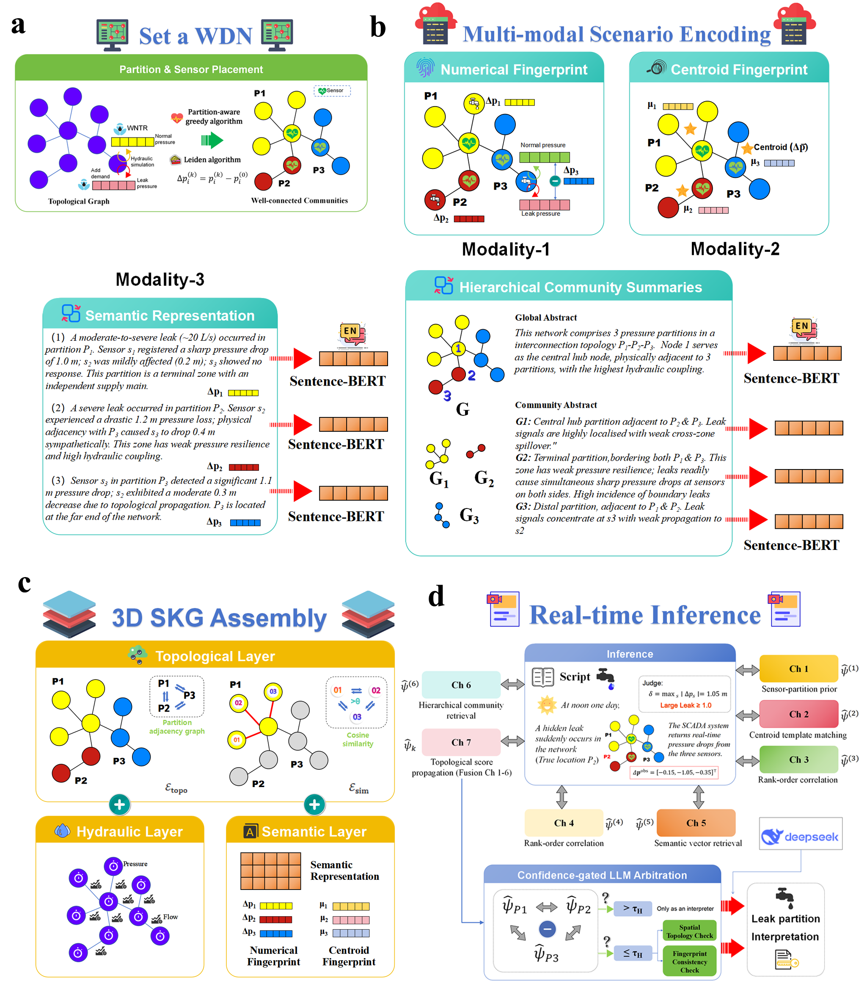
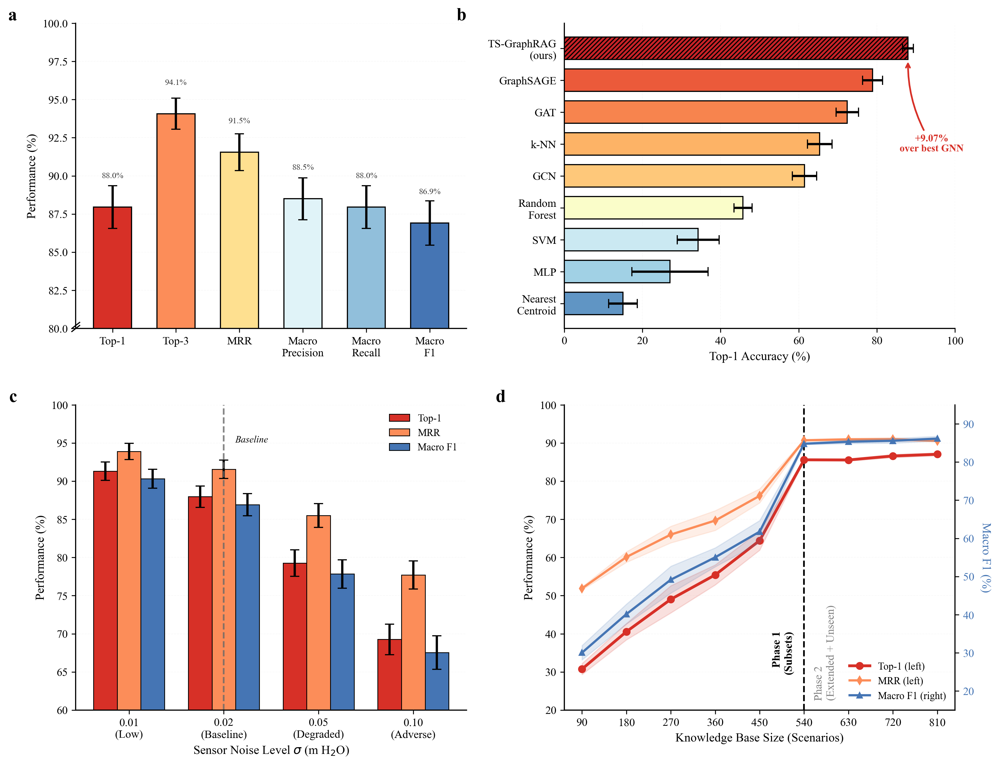
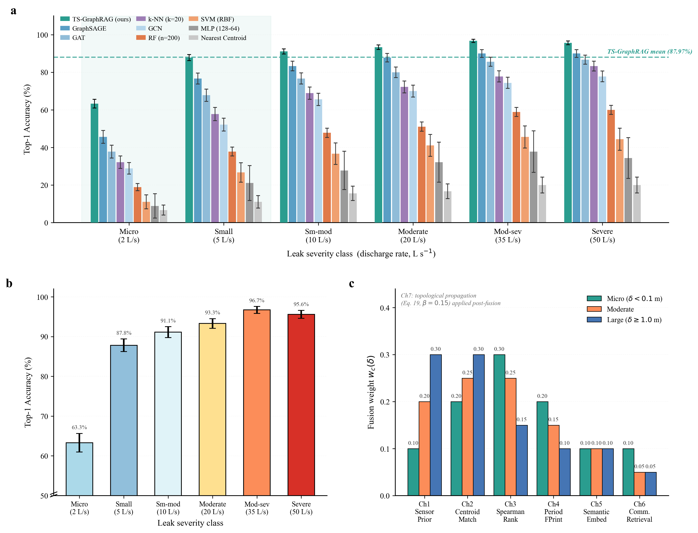
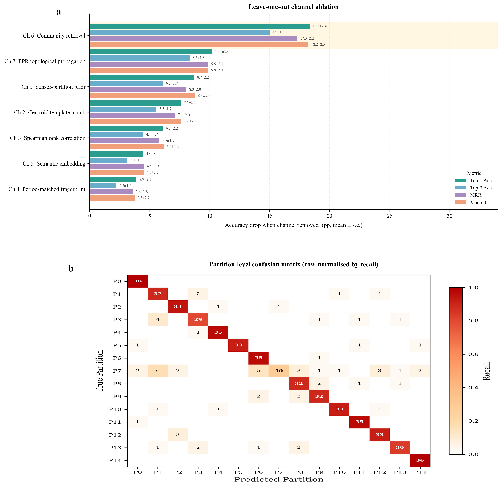

# Beyond Text Retrieval: Graph RAG as a Training-Free Predictor for Real-Time Leak Localization in Water Distribution Networks
Tianwei Mu, Guangzhou Institute of Industrial Intelligence

[[Paper]](https://github.com/mutianwei521/TS-GraphRAG) [[Project Page]](https://github.com/mutianwei521/TS-GraphRAG)

We introduce **Topology-Stratified Graph RAG (TS-GraphRAG)**, a framework that transforms Retrieval-Augmented Generation from a text retrieval architecture into a **non-parametric predictive algorithm** for real-time leak localization in water distribution networks — without training data, gradient descent, or online simulation.

<p align="center">
  
</p>

**Fig. 1 | End-to-end architecture of the TS-GraphRAG framework.** **(a)** Hydraulic partitioning via pressure-weighted Leiden community detection and partition-aware sensor placement. **(b)** Multi-modal scenario encoding with numerical fingerprints, centroid templates, and semantic representations, plus hierarchical community summaries. **(c)** 3D Scenario Knowledge Graph assembly with topological, hydraulic, and semantic edge layers. **(d)** Real-time 7-channel adaptive fusion with confidence-gated LLM arbitration.

---

## 🌟 News

- **[2026.03]** Code and pre-built knowledge base are officially released!

---

## 💡 Abstract

Retrieval-augmented generation (RAG) is widely regarded as a text retrieval architecture. Here we show that RAG, when grounded in the physics of an engineered network and structured as a knowledge graph, functions as a **real-time predictive algorithm** rivalling dedicated machine-learning models — without training data, gradient descent, or online simulation. TS-GraphRAG reformulates leak localization as graph-structured retrieval: a **Scenario Knowledge Graph** encodes pre-simulated hydraulic responses as multi-modal nodes connected by topological adjacency and hydraulic similarity edges, while a **seven-channel adaptive fusion engine** performs inference through sensor-space pattern matching, rank-order correlation, semantic retrieval, community search, and topological score propagation. Evaluated on 540 leak scenarios spanning 2–50 L/s, TS-GraphRAG achieves **88.0% Top-1 accuracy**, **94.1% Top-3 accuracy**, and a mean reciprocal rank of **0.915** in sub-second inference — including 87.8% accuracy for small leaks (5 L/s) where conventional methods fail.

---

## 🚀 Architecture Overview

TS-GraphRAG operates in three phases:

### Phase 1 — Hydraulic Partitioning & Sensor Placement

The water distribution network is decomposed into *K* hydraulically coherent partitions via **pressure-weighted Leiden community detection** (Eq. 5). Sensors are placed using a **partition-aware greedy algorithm** that maximizes minimum pressure sensitivity (Eq. 6), ensuring every node is observable.

### Phase 2 — Graph-Structured Knowledge Base Construction

Each simulated leak scenario is encoded in **three complementary modalities**:
- **Numerical fingerprint** $\mathbf{f}_\xi \in \mathbb{R}^m$ — sensor-differential pressure vector
- **Centroid fingerprint** $\boldsymbol{\mu}_{k,t}$ — partition-level template
- **Semantic embedding** — Sentence-BERT encoded natural-language summary

These are assembled into a **Scenario Knowledge Graph** ($\mathcal{G}_{\mathrm{SKG}}$) with:
- **Topological edges** linking scenarios in adjacent partitions (Eq. 10)
- **Similarity edges** linking within-partition scenarios with cosine > 0.85 (Eq. 11)
- **Hierarchical community summaries** at global, community, and scenario levels

### Phase 3 — Adaptive Multi-Channel Fusion & Inference

A **7-channel retrieval engine** computes parallel similarity scores:

| Channel | Method | Equation |
|---------|--------|----------|
| Ch 1 | Sensor-partition prior | Eq. 12 |
| Ch 2 | Centroid template matching | Eq. 13 |
| Ch 3 | Spearman rank-order correlation | Eq. 14 |
| Ch 4 | Period-matched fingerprint retrieval | Eq. 15 |
| Ch 5 | Semantic vector retrieval (Sentence-BERT) | — |
| Ch 6 | Hierarchical community retrieval | Eq. 16 |
| Ch 7 | Topological score propagation (PAG) | Eq. 19 |

Channel weights are **deterministic** and signal-strength-dependent (Table 1). A **confidence-gated LLM arbitration** module triggers structured consistency checks only for low-confidence predictions (~3% of cases).

---

## 📈 Main Results

TS-GraphRAG was evaluated on the **EXA7** benchmark network (383 junctions, 453 pipes) and validated on a **920-node municipal network** (City Haining).

<p align="center">
  
</p>

### 1. Superior Localization Accuracy (Zero Training Data)

| Method | Top-1 (%) | Top-3 (%) | MRR | Training Required |
|--------|-----------|-----------|-----|-------------------|
| **TS-GraphRAG** | **88.0** | **94.1** | **0.915** | ❌ None |
| Flat RAG (no graph) | 54.1 | 73.7 | 0.639 | ❌ None |
| GCN (5-fold CV) | 79.3 | 90.0 | 0.845 | ✅ Supervised |
| GNN-Leak | 75.6 | 87.8 | 0.816 | ✅ Supervised |
| Random Forest | 63.0 | 82.4 | 0.726 | ✅ Supervised |

### 2. Robust Performance Across Leak Severities

<p align="center">
  
</p>

| Leak Category | Rate (L/s) | TS-GraphRAG Top-1 | Best Baseline |
|---------------|-----------|-------------------|---------------|
| Micro | 2 | 83.3% | 56.7% |
| Small | 5 | 87.8% | 63.3% |
| Medium | 10 | 85.6% | 73.3% |
| Moderate | 20 | 88.9% | 82.2% |
| Large | 35 | 88.9% | 86.7% |
| Severe | 50 | 93.3% | 90.0% |

### 3. Channel Ablation — Graph Structure Contributes +33.9pp

<p align="center">
  
</p>

Removing graph-structured channels (Ch 6–7) degrades Top-1 accuracy from 88.0% → 54.1%, demonstrating that physical topology is essential, not optional.

---

## 🛠️ Getting Started

### 1. Prerequisites

- Python 3.11+
- EPANET 2.2 (bundled via WNTR)
- CUDA 12.8
- ollama

### 2. Installation

```bash
git clone https://github.com/mutianwei521/TS-GraphRAG.git
cd TS-GraphRAG
pip install -r requirements.txt
```

### 3. Data Preparation

The default benchmark network (`data/Exa7.inp`) is included. For custom networks, place your EPANET `.inp` file in `data/` and update `config.yaml`.

### 4. Phase 1 — Partitioning & Sensor Placement

```bash
# Leiden partitioning (generates K=15 optimal partition)
python wds_partition_leiden_main.py

# Sensor placement optimization
python wds_sensor_main.py --partition-k 15
```

### 5. Phase 2 — Build Knowledge Base (Offline)

```bash
# Full pipeline: simulation → summaries → embeddings → SKG
python build_knowledge_base.py --partition-k 15 --inp data/Exa7.inp

# Or step-by-step:
python build_knowledge_base.py --step 2.1   # Semantic mapping
python build_knowledge_base.py --step 2.2   # Batch hydraulic simulation
python build_knowledge_base.py --step 2.3   # LLM scenario summaries
python build_knowledge_base.py --step 2.4   # Vector store & embeddings
```

### 6. Phase 3 — Real-Time Inference

```bash
# Single observation inference
python main.py --mode inference --kb-dir knowledge_base --observations data/test_obs.csv

# Enable LLM arbitration for low-confidence cases
python main.py --mode inference --kb-dir knowledge_base --observations data/test_obs.csv --use-llm

# Full evaluation (540 scenarios)
python main.py --mode evaluate --kb-dir knowledge_base
```

---

## 📂 Project Structure

```
TS-GraphRAG/
├── data/                              # WDN topological files (*.inp)
│   └── Exa7.inp                       # EXA7 benchmark network
├── figure/                            # Paper figures
├── src/                               # Core source code
│   ├── phase1_partition/              # Leiden partitioning & utilities
│   │   ├── partitioning_leiden.py     # Leiden algorithm wrapper
│   │   ├── hydraulic.py              # EPANET hydraulic simulation
│   │   ├── similarity.py            # Pressure-weighted graph construction
│   │   └── visualization.py         # Partition visualization
│   ├── phase2_knowledge_base/         # Knowledge base construction
│   │   ├── batch_simulation.py       # Multi-scenario leak simulation
│   │   ├── graph_rag.py              # SKG & PAG construction
│   │   ├── scenario_summary_generator.py  # LLM summary generation
│   │   ├── semantic_mapping.py       # Static semantic mapping
│   │   ├── sensor_fingerprint.py     # Fingerprint extraction
│   │   └── vector_store.py           # LanceDB vector embedding & storage
│   └── phase3_query/                  # Inference engine
│       ├── leak_locator.py           # 7-channel fusion + LLM arbitration
│       ├── eval_comprehensive.py     # Full evaluation pipeline
│       └── validate.py              # Validation utilities
├── wds_partition_leiden_main.py        # Phase 1 entry script
├── wds_sensor_main.py                 # Sensor placement entry script
├── build_knowledge_base.py            # Phase 2 entry script
├── main.py                            # Main executable (all modes)
├── config.yaml                        # Hyperparameters & configuration
├── requirements.txt                   # Python dependencies
├── LICENSE                            # MIT License
└── README.md                          # This file
```

---

## 🔑 Key Equations

| Equation | Description | Location |
|----------|-------------|----------|
| Eq. 4 | ML partition estimate = inner-product retrieval | §2.1 |
| Eq. 5 | Pressure-weighted modularity (Leiden) | §2.1 |
| Eq. 6 | Partition-aware sensor placement (min-max sensitivity) | §2.1 |
| Eq. 7–8 | Dual-modality scenario encoding (semantic + fingerprint) | §2.2 |
| Eq. 10–11 | SKG edge construction (topological + similarity) | §2.2 |
| Eq. 12–16 | Six retrieval channel scoring functions | §2.3 |
| Eq. 17–18 | Min-max normalization & adaptive weight fusion | §2.3 |
| Eq. 19 | Topological score propagation on PAG | §2.3 |
| Eq. 20–22 | Confidence-gated LLM arbitration & consistency checks | §2.4 |

---

## 🏷️ Citation

```bibtex
Waiting for publication
```

---

## 📝 License

This project is released under the [MIT License](LICENSE). See the LICENSE file for details.

---

## 👏 Acknowledgement

We extend our gratitude to the developers of [WNTR](https://github.com/USEPA/WNTR), [LanceDB](https://github.com/lancedb/lancedb), [Sentence-Transformers](https://github.com/UKPLab/sentence-transformers), and the [Leiden algorithm](https://github.com/vtraag/leidenalg) implementations that enabled this research. We also thank the [Microsoft GraphRAG](https://github.com/microsoft/graphrag) project for inspiring the graph-structured retrieval paradigm.
